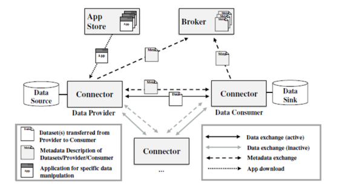
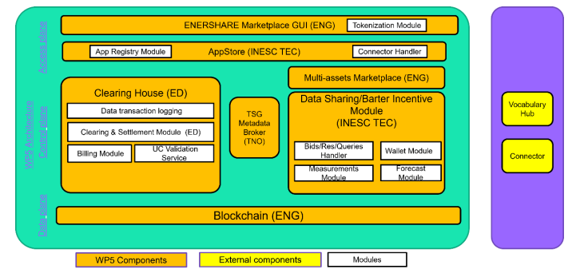
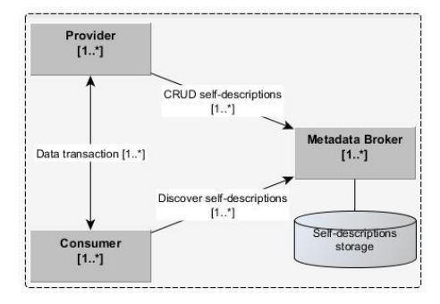
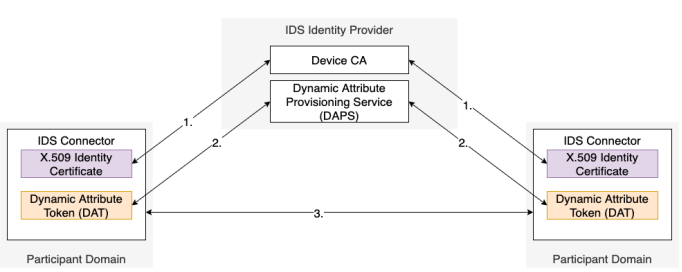
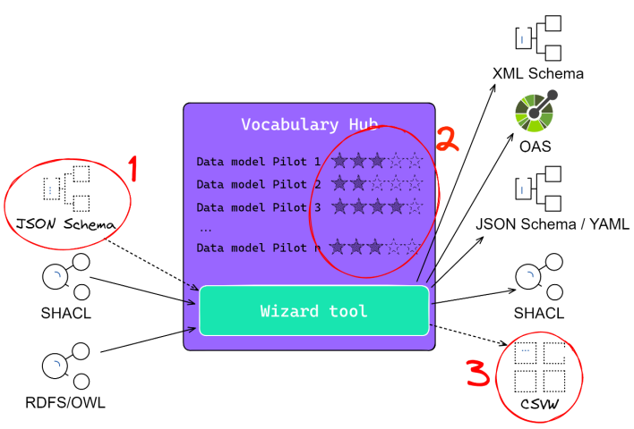
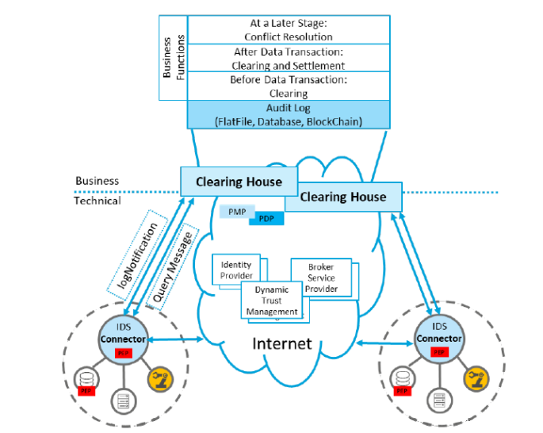
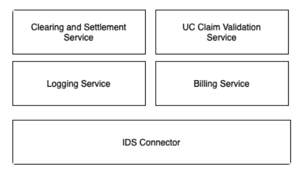
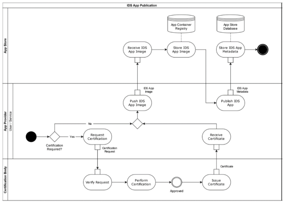
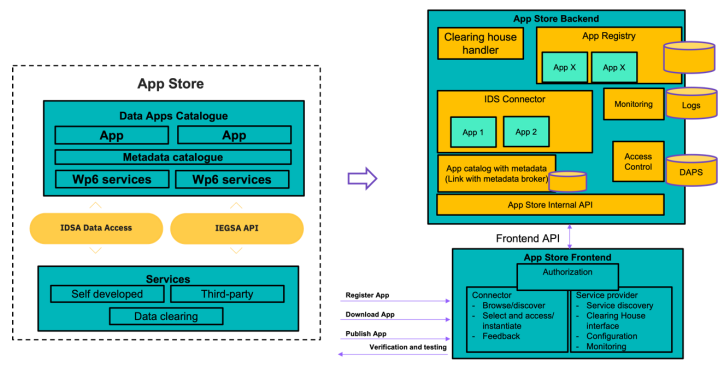
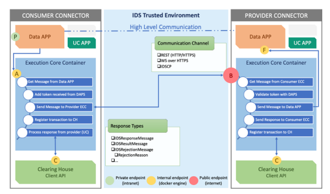

# Enershare (MVP2 readme)
ENERSHARE scope and objectives are considered to cover three core cornerstones. Trust and sovereignty of data, interoperability of data and participants, and the business logic/applications consist the set of these three concepts that ENERSHARE aims to focus on. Besides ENERSHARE is closely related on and influenced by the IDS reference architecture for International Data Spaces which introduces a benchmark for developing data-driven products, ecosystems, and services, providing a standardized framework for implementation and development. A data space consists of a network of parties and components. In the International Data Spaces Reference Architecture Model (IDS-RAM) this network is formed by connectors. In other words, each component or service in a data space is represented by a connector. An IDS connector allows and enables the exchange of data within a data space. It provides a number of core functions that are extended with business logic inside a data app. Among the Connector Core Service(s) are the means for Authentication, Contract Negotiation and Trusted Data Exchange. 

This documentation refers in the particular components of MVP2.0. The MVP2.0 is comprised of the following elements:
- [The TNO Security Gateway (TSG) Connector](#the-tno-security-gateway-tsg-connector)
- [Metadata Broker](#metadata-broker)
- [Identity Provider (CA + DAPS)](#identity-provider-ca--daps)
- [Vocabulary Hub & Wizard for generation of Open APIs](#vocabulary-hub--wizard-for-generation-of-open-apis)
- [OpenAPI Interfaces](#openapi-interfaces)
- [Transformation Service](#transformation-service)
- [Compliance Service](#compliance-service)
- [Mashup Editor](#mashup-editor)
- [Semantic Models](#semantic-models)
- [Marketplace](#marketplace)
- [Clearing House](#clearing-house)
- [AppStore](#appstore)
- [Blockchain & Notarisation Services](#blockchain--notarisation-services)\

A set of available complementary components will provided based on the FIWARE True Connector:
- [The True Connector](#the-true-connector)
- [Usage Control & Rules enforcement implementation in TRUE connector](#usage-control--rules-enforcement-implementation-in-true-connector)
- [FIWARE Context Broker](#fiware-context-broker)

# TSG connector and side components 

ENERSHARE’s scope and objectives as a project aim to cover three core cornerstones which are: 

i) Trust and sovereignty of data, 

ii) interoperability of data and participants, and

iii) the business logic and the necessary applications which automate the same business logic. 

For this reason ENERSHARE is closely related on and influenced by the IDS reference architecture for International Data Spaces and the OPENDEI building blocks which introduce a benchmark for developing data-driven products, ecosystems, and services, providing a standardized framework for implementation and development. A data space consists of a network of parties and components. In the International Data Spaces Reference Architecture Model (IDS-RAM) this network is formed by connectors.

More information and the documentation regarding the aforementioned technologies can be accesses in the following links:

+ OPENDEI building blocks : **https://docs.internationaldataspaces.org/ids-knowledgebase/v/open-dei-building-blocks-catalog**
+ International Data Spaces Reference Architecture Model : **https://docs.internationaldataspaces.org/knowledge-base/ids-ram-4.0**

The overall architecture based on the IDS interaction components business process flow and the role of the IDS connector in it is illustrated in the following figure: 

The core ENERSHARE objective is the implementation of the envisioned business logic and user experience as managed by an ecosystem for easy, trusted and interoperable data exchange. This business logic leverages a value-added Marketplace containing a shop window (to sell data service, dataset, charging station availability and Apps), a session-based electricity marketplace, a barter of data and the cross-domain assets/services auction and facilitation.

The core components which are responsible to ensure and enhance the aforementioned concepts are described in the following figure: 

## The TNO Security Gateway (TSG) Connector
The basic MVP2 implementation of the IDSA Connector is the TNO Security Gateway (TSG) Core Container. The TSG container operates as a base for data space components (since participation in a Data Space as a stakeholder is possible only through a connector) and can be easily integrated with services and data apps. These data apps perform the business logic for both data consumers and providers, in the same way that is required in ENERSHARE.

**Description and Purpose**

The TSG Connector performs seamless collaboration and data sharing, supporting the participants to exploit the maximum potential of their data components and assets and evolve their practices. Additionally, based on the TSG concept simultaneously with the IDSA architecture, the TSG connector ensures the establishment of very specific rules and principles customized and aligned according to the project’s objectives. TSG Connector adheres to an IDSA-based HTTP Multipart communication protocol, automating message flows and being easily deployable.

**Development Progress**

MVP2 updated the TSG Connector and its related components functionality. Currently TSA connector is being updated to function under the new Data Space protocol. The TSG Connector is developed in Kotlin and built within Docker images. 

Already, a set of 15 connectors have been deployed within Enershare data space. 

**Technical functional and structural details**

Detailed technical information about the TSG Connector can be found in the following links: 

+ TNO Security Gateway Architecture & Documentation : **https://tno-tsg.gitlab.io/**
+ TSG Core Container : **https://gitlab.com/tno-tsg/core-container**
+ TSG Connector Helm Chart : **https://gitlab.com/tno-tsg/helm-charts/connector**
+ ENERSHARE Connectors : **https://daps.enershare.dataspac.es/#connectors**
+ IDS Connector : **https://docs.internationaldataspaces.org/ids-knowledgebase/v/ids-ram-4/layers-of-the-reference-architecture-model/3-layers-of-the-reference-architecture-model/3_5_0_system_layer/3_5_2_ids_connector**

The usage control functionality that is provided by TSG Connector and the individual components that perform it are presented in **section 5.2.2 in ENERSHARE deliverable D4.2 - "Enershare Trust and sovereignty building blocks (Beta version)"**.

The technical description of the communication and data exchange between a data provider’s TSG connector and a data consumer’s TSG connector (Policy negotiation) is presented in detail in **section 5.3.4 in the ENERSHARE deliverable D4.2**. The involved sub-components and the steps that are performed in order to communicate two TSG connectors are presented in a sequence diagram in the aforementioned section.

## Metadata Broker
The Metadata Broker is a core component of the Data Space as it is an IDS Connector which contains an endpoint for the registration, publication, maintenance, and query of connector self-descriptions. As such it is part of the ENERSHARE Data Space. Every connector participating in the project has its own “functionality catalogue” that contains its resource self-descriptions, according to the IDSA reference architecture. An IDSA connector can provide various resources, so the specific catalogue may include multiple self-descriptions. For a data consumer to locate specific resources across different connectors, it needs to query multiple catalogues, find the desired resources and then integrate the results.

**Description and Purpose**

The Metadata Broker operates like a centralized catalogue of resource self-descriptions within the ENERSHARE Data Space. Specifically, it provides a central access point to resource self-descriptions where data providers can register their services and themselves in a way that they are discoverable by Data consumers.

A Self-Description encapsulates information about IDS Connector itself and its capabilities and characteristics. This Self-Description contains information about the offered interfaces, the owner of the component and the metadata of the data offered by the component. A Self-Description is provided by the operator of the Connector. The Self-Description in total can be seen as metadata. 

The process that is followed to take advantage of the Metadata Broker is step-wise. 

1.As the first step, the data provider registers, publishes, and updates self-descriptions in the Metadata Broker. 

2.Following the publication, these self-descriptions are discovered by data consumers who make queries to the Metadata Broker. The self-descriptions contain the appropriate information for the Consumer to find the best matching and connect to the connector of the provider to consume the data.

This process is also described in the following image:

**Development Progress**

The TSG Metadata Broker is considered to be the best choice for the ENERSHARE Metadata Broker as one of individual components that allow a participant to be part of an IDS data space. The TSG Metadata Broker does not participate in the actual data exchange although is implemented as an IDSA Connector. The TSG Metadata Broker implements a Fuseki triple store backend to enable the SPARQL query functionality.

**Technical functional and structural details**

The Metadata Broker is a combination of a TSG Core Container and a Broker Data App. The Core Container serves as the hub of the IDS ecosystem and facilitates IDS messaging, message routing, artifact handling, container orchestration, policy enforcement, and embedded workflow management. The Broker Data App carries out the business logic for managing self-descriptions.

More information about the Metadata Broker processes and functionality can be found in the below links:

+ IDS Metadata Broker from IDSA RAM: **https://docs.internationaldataspaces.org/ids-ram-4/layers-of-the-reference-architecture-model/3-layers-of-the-reference-architecture-model/3_5_0_system_layer/3_5_4_metadata_broker https://gitlab.com/tno-tsg/broker/data-app/-/tree/master**
+ Gaia-X federated catalogue : **https://docs.gaia-x.eu/technical-committee/architecture-document/latest/federation_service/#federated-catalogue**

More information about the functionality of the Metadata Broker and his role in the overall architecture of ENERSHARE can be found in the **section 5.4 of the ENERSHARE deliverable D5.1 - “ ENERSHARE Data Value Stack (Alpha version)”**.

More information about the interfaces (description, “provided to”, End-point, protocol used and allowed methods) and the data exchange with other components are described in the **section 6.4 in the ENERSHARE deliverable D5.2 “ENERSHARE Data Value Stack (Beta version)”**.

## Identity Provider (CA + DAPS)
The ENERSHARE project follows the data space principles as they are described in OPENDEI initiatives. One of the technical building blocks for OPENDEI is the one which guarantees Trust among its users. Identity Management is extremely important for ensuring trust within a data space ecosystem. Specifically, Identity management enables authentication, identification and authorization among the participants of the data space.

**Description and Purpose**

ENERSHARE implements the Identity Provider component in order to handle the Identity management within the digital environment. Identity Provider is introduced within the IDSA Reference Architecture as one of its core components, which is responsible to perform the identity and access management. Specifically, the Identity Provider is an Intermediary that provides functionalities to create, manage, maintain and validate identity data of and for the participants. Additionally, the Identity Provider is composed of three sub-components, namely, the Certificate Authorities (CAS), the Dynamic Attribute Provisioning Service (DAPS) and the Participant Information Service (ParIS).

The structure of the Identity Provider and its relationship with the IDS Connector is also described in the following image:

**Development Progress**

The implementation of the Identity Provider consists mainly of the CA and DAPS components. Both these components are developed using Typescript and they function through generic frontend and backend applications.

Identities operate currently by using x.509 certificates for asserting identities for organizations, persons, or other types of entities and various attributes if needed. Decentralized Identifiers (DIDs) are a new form of identities that enables organizations and individuals to create and manage their personal digital identities without relying on centralized authorities.

**Technical functional and structural details**

Technical information about the  the CA & DAPS reference architecture and instructions for deployment and usage can be found in the below links:

+ TSG DAPS (Backend & Geberic UI) : **https://gitlab.com/tno-tsg/daps**
+ TSG DAPS Documentation : **https://tno-tsg.gitlab.io/docs/daps/**
+ IDS Certificate Authority : **https://github.com/International-Data-Spaces-Association/IDStestbed/tree/master/CertificateAuthority**
+ IDS DAPS : **https://github.com/International-Data-SpacesAssociation/omejdn-daps**

**Section 4.2 in the ENERSHARE deliverable D4.1 - “Trust and sovereignty building blocks (Alpha version)”** analyzes in detail the tools, features and functionality of the Identity Provider.

## Vocabulary Hub & Wizard for generation of Open APIs

**Description and Purpose**

The primary objective of the Vocabulary Hub is to enhance semantic interoperability by aiding data space participants in adopting standardized vocabularies. In essence, it concentrates on adoption and sharing of standardized vocabularies among a community of users.

Within ENERSHARE, the Vocabulary Hub is meant to be launched and utilized during the design phase of the project, as data consumers and providers configure and create their data sharing interfaces. Emphasizing on accomplishing semantic interoperability during this phase, Vocabulary Hub strives for results of higher metadata quality and better alignment with the Data Space direction. Consequently, shared data becomes a more interoperable, reusable and discoverable part of the ecosystem. The distributed and decentralized structure of data spaces yields significant implications for semantic interoperability. Data providers need to effectively publish and describe their data sources to ensure they are readily discoverable and reusable for data consumers, without technical permissions, even without prior familiarity with those specific consumers. This necessitates the utilization of common shared vocabularies. The Vocabulary Hub component serves as a central repository of vocabularies, ensuring their discoverability and accessibility. Moreover, the Vocabulary Hub component can offer services to facilitate adoption of the aforementioned vocabularies by data owners, fostering interoperability even more.

**Development Progress**

ENERSHARE is enriching and further developing the Energy Vocabulary Hub, originated from the BD4NRG project.This specific implementation of the vocabulary hub component employs the open-source software Semantic Treehouse, a project spearheaded by TNO. One significant method through which the Energy Vocabulary Hub encourages the uptake of established standards is by enabling model-driven development of schemas, data models, and Open API specifications.

The Energy Vocabulary Hub component includes two functional extensions introduced in the scope of ENERSHARE WP3 objectives. The first extension entails expanding the Wizard's functionality to support standardized JSON vocabularies, like Smart Data Models. The second extension involves integrating support for the five-star framework for vocabulary utilization. This framework defines five stages in the progression toward enhanced semantic interoperability. Each stage is represented by a specific number of stars, starting from one star and progressing up to the full five stars for the final stage.

The wizard is an integral component of the Vocabulary Hub, providing users with a simplified approach to create API specifications or schemas that are aligned to standardized, predefined ontologies with the following sequence of steps:

1. Identifying and selecting suitable ontology for their use case, e.g., OEO or SAREF.

2. Developing a data model of their dataset in the Vocabulary Hub by selecting all relevant properties/classes from the selected ontology from step 1.

3. Letting the Vocabulary Hub to automatically generate an API specification or schema based on the data model created in step 2.

The Core functionality of the Vocabulary Hub and the Wizard is presented in the following figure:

**Technical functional and structural details**

The Energy Vocabulary Hub component that has been deployed by TNO is accessible at the following link: **https://energy.vocabularyhub.eu/**.

The Vocabulary Hub component and its wizard sub-component have been thoroughly introduced in deliverable D3.1 - “ENERSHARE interoperability building blocks (Alpha version)” and, subsequently, further analyzed in deliverable D3.2 - “ENERSHARE interoperability building blocks (Beta version)”.

Techincal details regarding the wizard component are available in **section 5.1 of deliverable D3.1 “ENERSHARE interoperability building blocks (Alpha version)**.

The extended functionality and development goals from MVP1 to MVP2, namely the “support for JSON Schema-based data models” and “implementing the five-star model of vocabulary use”, are thoroughly presented in **sections 4.1.3 and 4.1.4 of the ENERSHARE deliverable D3.2 ENERSHARE interoperability building blocks (Beta version)**. These two sections describe the methodology, functionality details, examples, main limitations, UX designs and next steps towards the final release.

## OpenAPI Interfaces

**Description and Purpose**
Open APIs which are based on a common, shared semantic data model are the essential structure for ensuring semantic interoperability within ENERSHARE, especially during a data exchange process. 

An Open API will be developed for each type of data service, in the Business use cases that require information exchange between Data space participants. These Open APIs specify how to structure and formalize the data exchanged between data providers and data consumers. A crucial prerequisite is the capability of the data provides to describe and publish the data sources, to be exchanged, in a way that makes them easily usable and discoverable for data consumers.

**Development Progress**

The development of the Open API for a specific service follows a structured sequence of the following steps:

1. The first step includes the analysis of the input and output data that will be involved with the specific service.

2. Consequently, each attribute and concept of the input and output is mapped to a specific property or class within the project’s semantic model.

3. Next, these parameters are mapped to the properties and concepts of the ontology and described graphically.

4. Having these mappings clear and ready, the inputs and outputs are structured according to a specific semantic data format, in JSON-LD or in Turtle.

5. Finally, the Open API specifications are stored in JSON/YAMI files. These specifications are utilized by the pilots to describe their services and to create the appropriate REST APIs in the data spaces environment in order to be, used by potential data consumers.

A new approach for data exchange interoperability, based on data transformations, is proposed for MVP2. This approach is also suitable for low latency and big volumes of data exchange

**Technical functional and structural details**

More information about the internal structure, the functionality and the development of an Open API implementation are presented in **section 4.2 of the deliverable D3.2 “ENERSHARE interoperability building blocks (Beta version)”**.

Detailed technical information about schemas aligned with Smart Data Models using NGSI-LD and the Data Models Contribution API can be accessed in the below link:
**https://smartdatamodels.org/index.php/data-models-contribution-api/**

## Transformation Service

**Description and Purpose**

Besides the pure technical data exchange, a new approach for data exchange interoperability, based on data transformations, is proposed within MVP2. A new service has been implemented, called Transformation Service. This specific service is responsible for transforming a given input in a structured source format followed by a mapping file with RML rules, to an output in a specific requested serialization format. Within ENERSHARE, there are three options referring the transformation of exchanged data, namely, Data exchange without transformations, Data transformations at the provider and Data transformations at the consumer.

**Development Progress**

Data transformation service component is defined as a Representational State Transfer (REST) service that is implemented using Python language. The supported data format inputs are any data in a structured source format with a mapping file in RDF Mapping Language rules. The supported data format outputs are including json-ld, nquads, trig, turtle, xml, hext, pretty-xml, trix and longturtle. Finally, every method of the service requires, beside the aforementioned prerequisites, the filling of some specific information about the call that is needed, namely, the Title, URL, Method, Data Params, Required and Optional extra information, success/error responses and Sample call.

The Transformation service makes use of a Swagger UI endpoint which is responsible for the user-friendly execution of the rest service by the user. The Data transformation service is divided in three offered methods. First, the method to test the connection with the service endpoint, second the method to convert data given the URLs of the data source and mapping files and third the method to convert data given the content of the data source and mapping files.

**Technical functional and structural details**

More information about the functionality and the use cases of the Transformation Service are presented in **sections 2.4 and 4.3 of D3.2 “ENERSHARE interoperability building blocks (Beta version)”**.

Detailed technical information about the Transformation services implementation and the UI endpoint that was mentioned above can be accessed in the below link:
**https://transformation.enershare.urban.tecnalia.dev/docs**

## Compliance Service

**Description and Purpose**

The Compliance Service comes to support interoperability within ENERSHARE in the connector level. This specific service is responsible to validate any RDF graph against the conditions defined in the shapes graph, given as input a semantic model and a SHACL file. In that way, the Compliance service enable the validation of the APIs by the connectors regarding the SHACL files provided for each Open API.

**Development Progress**

Compliance service component is defined as a Representational State Transfer (REST) service that is implemented using Python language. The supported data files that operate as input for the Compliance service are SHACL files, which contain Shapes Constraint Language (SHACL) for describing and validating RDF graphs.

The Compliance service makes use of a Swagger UI endpoint which is responsible for the user-friendly execution of the rest service by the user. The Data transformation service is divided in three offered methods. First the method to test the connection with the service endpoint, second to validate the data given the URLs of the data model and shapes files and third themethod to validate data given the content of the data model and shapes files.

**Technical functional and structural details**

More information about the functionality and the use cases of the Compliance Service are presented in **sections 4.4 of D3.2 “ENERSHARE interoperability building blocks (Beta version)”**.

Detailed technical information about the Compliance services implementation and the UI endpoint that was mentioned above can be accessed in the below link:
**https://compliance.enershare.urban.tecnalia.dev/docs**

## Mashup Editor

**Description and Purpose**

The Data Mashup Editor is a flexible component applicable in various use case scenarios, including data transformations and data harmonization. 

+ Data transformation process converts data from a specific format to another or from a specific system to another.
+ Data harmonization is similar to data integration, in that it involves bringing disparate data sources together into a single location. However, harmonization goes a step further by reorganizing data according to a single schema, so that data are accurate, consistent and usable.

The Data Mashup Editor can be utilized at runtime, for instance, by connectors, to create data transformation workflows. These workflows are able to convert stored data in the systems of the provider into the NGSI-LD format, as defined in the operation of the OpenAPIs before sending it to the consumer.

**Development Progress**

The Data Mashup Editor implementation is part of the Digital Enabler, an “Ecosystem” platform created by ENG. The Data Mashup Editor offers to the Digital Enabler the functionality of building correlations among different datasets and develops Smart Data Models graphically.

Towards the final release of ENERSHARE, the Data Mashup Editor will be seamlessly integrated and aligned with the NGSI-LD standard simultaneously with the improvement of the user interaction and the usability of the component. Additionally, it will be developed and validated at least in one pilot that is related with data-driven services. Since the use cases within ENERSHARE are many and heterogeneous the significant progress and enhancement in Data Mashup Editor development are extremely important. Data Mashup Editor appears to be a flexible, scalable, reliable and robust solution for data and structure processing, in regards to the energy domain.

Generally, the Mashup Editor allows users to develop tailored workflows, manage them and monitor them in real-time.

**Technical functional and structural details**
Data Mashup Editor is composed of four crucial modules that operate seamlessly, namely:

1. The Operator, which is the component responsible to perform a data processing task and is able to be combined with other different operators and perform complex data process functionalities.
2. The Data source, which provides access for the users to APIs and external datasets that compose data processing workflows.
3. The Mashup, which is the visual representation of a set of data processing phases that is composed of on or multiple Operators and one or multiple Data sources.
4. The Flow, which is the saved version of a Mashup that is the real-world deployment product of the Mashup and defines the input and output of the data sources of the Mashup allowing manage and monitor their Mashup execution.

More information about the individual sub-components and the functionality  of the Mashup Editor are presented in **section 5.4 of the deliverable D3.1 “ENERSHARE interoperability building blocks (Alpha version)”**.

Detailed technical information about the Mashup Editor concepts and implementation can be accessed in the below links:

+ Data Harmonization : **https://www.integrate.io/glossary/what-is-data-harmonization/**
+ Digital Enabler Platform : **https://www.eng.it/en/our-platforms-solutions/digital-enabler**

## Semantic Models

**Description and Purpose**

As mentioned above, ENERSHARE’s main objective is to build every component under specific principles, in order to achieve interoperability among all the stakeholders in the energy domain. Additionally, to provide the tools to interact with, query and foster the adoption of the defined semantic models. For these reasons, MVP2 develops and utilizes interoperable semantic data models. Finally, it utilizes two tools for the management of these data models, namely the Vocabulary Hub that register and store them and the Visualization Portal that provides a visualization of the data models and their easy discovery.

**Development Progress**

Regarding the semantic data models, the project adapts and reuses the PLATOON26 semantic data models and methodology. The steps that are used by MVP2 to design and develop the data models are the ontology requirements specification, the ontology analysis, the design of ontological diagrams for each pilot and finally the harmonization & Formalization process.

Besides, to achieve its interoperability objective, the second technology release makes use of the Open Energy Ontology (OEO). OEO is a set of interconnected ontologies that are gathered developed to semantically model the energy data domain.

ENERSHARE divides the topic landscape that should be described by the data models in six categories:

1. The first category refers to the renewable energy domain.
2. The second category refers to the flexibility domain.
3. The third category refers to the building energy “behaviour”.
4. The fourth category refers to the energy community.
5. The fifth category refers to the grid domain.
6. Finally, the sixth category refers to the common notions that are exchanged by each use case like sensors, forecast, weather etc.

**Technical functional and structural details**

More information about the individual sub-components and the functionality  of the Mashup Editor are presented in **section 3 of the deliverable D3.2 “ENERSHARE interoperability building blocks (Beta version)"**.

Detailed technical information about the Semantic Models concepts and implementation can be accessed in the below links:

+ Open Energy Ontology: **https://openenergyplatform.org/ontology/**
+ PLATOON implementation : **https://platoon-project.eu/**

## Marketplace

**Description and Purpose**

The ENERSHARE Marketplace comes to support the business logic and objective of the project.The overall concept of the marketplace is the implementation of a Graphical Use Interface that provides a common entry point for the interaction with the functional components and the access to all the operations of WP5. 

The users of the Marketplace are the Marketplace Participant and the Marketplace Administrator. The Marketplace Participant is any user that wants to discover and buy/sell an asset. The Marketplace Administrator is an operator that is responsible to manage the users that participate in the Marketplace.

The Multi-assets Marketplace first of all supports the buying and selling of digital assets, such as data, energy, data services and cross domain services.

**Development Progress**

Regarding the development of the data monetization and sharing there are a few technical implementation requirements that need to be further developed. These are Data Contribution Methods, Data Types, Market Functions (Registration with Cryptocurrency Wallet, Authentication Mechanisms, Portfolio Management), Collaborative Forecasting, Market Engine and Secure Fund Management through Market Wallet. Besides them future advancements include the Scalability and Performance, the Advanced Forecasting Algorithms and the Enhanced Privacy and Security, that are planned to be achieved by simultaneous research and development optimization.

**Technical functional and structural details**

A descriptive catalogue of the actors and the use cases that are related with the Marketplace operation and objectives is presented in the **section 3 in the deliverable D5.1 “ENERSHARE Data Value Stack (Alpha version)”**. Every specific use case is followed by the related description, actors, priority, trigger, pre-conditions, post-conditions, basic flow, alternative flow and exception flow.

Additionally, the processes and interactions between the different actors and components within the Marketplace are presented with sequence diagrams in the **section 5 in the deliverable D5.2 “ENERSHARE Data Value Stack (Beta version)”**.

## Clearing House

The Clearing House is an important intermediary component of an IDSA environment that mediates and operates between the Data Consumer and the Data Provider ensuring that both parties respect their contractual rules.

**Description and Purpose**

The Clearing House is an authority component that is responsible for the evaluation of two individual use cases: first, the data exchange process from the Producer to the Consumer of the Data, aligned to defined Data Usage Policies and Usage Contracts and second, the utilization of data from the consumer of the data, aligned to Data Usage Policies and Usage Contracts according to the agreed payment to the Producers. Every data exchange transaction is followed by specific metadata such as pricing information, time of validity, payment entitlement, data usage restrictions etc. 

The Clearing House stores the contact agreements, information about data request, data response and data usage made under the corresponding agreement. Such information can be queried from all connectors that are part of the contract agreement.

The following figure describes the logic of Clearing House intervention along with a complete list of the generic business functions that are open for additional implementation.

**Development Progress**

The implementation of the Clearing House component follows partially the structure of the Fraunhofer-AISEC Clearing House albeit in a completely different manner. At the Clearing House level, the connector integration has been achieved (TSG Connector) and all contract logging functionality covering the operated data exchange is already part of the MVP2 release.

Additionally, a custom GUI application has been developed which accommodates customized user actions that are providing business, project, and domain specific functionalities. The core concept of this Clearing House is based on storing transaction logs in an immutable way.

The IDS Clearing House provides two basic operations for all data exchange and financial transactions that can take place in the project’s digital ecosystem, namely the clearing operation and the settlement operation on the basis of contract transaction metadata logging. 

The core architecture and components that process the aforementioned functions are described in the following figure:

Detailed technical information about the Clearing House functionality and component's implementation can be accessed in the below links:

+ Fraunhofer-AISEC Clearing House: **https://enershare.eurodyn.com/login**
+ Access to the Clearing House GUI : **https://platoon-project.eu/**

**Technical functional and structural details**

The overall information that describes the implementation process of the Clearing House can be found in **section 6.5 of the deliverable D5.1 ”ENERSHARE Data Value Stack (Alpha version)”**. This section contains information related with the actors, the scenarios described with process sequence diagrams and the overall role of the Clearing House in the project’s architecture.

## AppStore

**Description and Purpose**
The App Store is considered to be a core building block within an IDS environment; hence it is crucial component of the project. The App Store is responsible to interface with the connector and to enable Data application and services to be distributed within the data space. An application or service is an asset that can be accessed and downloaded from the App Store and be deployed executed and monitored by a connector owned by a user. Additionally, participants can also utilize the App Store to publish their Data applications in order to be accessed and used by other participants. The lifecycle workflow and architecture of the App Store can be seen in below figure:

Moreover, the key functionalities of App Store are: Browse available Data Apps, Publish Data Apps, Manage information and metadata about Data Apps, Retrieve Data App and Certification of Data Apps.

**Development Progress**

The AppStore is divided mainly in the backend and frontend implementations. The AppStore backend provides the essential integration with a data space instantiation, departing from an IDS compliant connector. The embedded connector is integrated with the AppStore's identity provisioning and participates in identity validation for all other interactions with external data connectors.

The sub-components that compose the AppStore are the AppStore Backend, the AppStore Frontend, the App Certification, the Dynamic Attribute Provisioning Service, the Keycloak IDM, the Marketplace IDP, the TSG Connector, the True Connector, the TSG Metadata Broker, the Docker Registry, the PostGreSQL and the MarketPlace Wallet.

The architecture and sub-components of the AppStore are also illustrated in the followinf figure:

**Technical functional and structural details**

The overall information that describes the processes implemented related of the AppStore can be found in **section 6.1 of the deliverable D5.1 “ENERSHARE Data Value Stack (Alpha version)”**. This section contains information related with the actors, the scenarios described with process sequence diagrams and the overall role of the App Store in the reference architecture.

Detail technical information regarding the development related to the MVP2 AppStore such as interfaces (description, “provided to”, End-point, protocol used and allowed methods) and the relationships with other Data Space components are accessible in **section 6.2 in deliverable D5.2 “ENERSHARE Data Value Stack (Beta version)”**.

## Blockchain & Notarisation Services

Blockchain is a technical structure that provides by design decentralization, security, immutability, trust, privacy and robustness. Blockchain can be deployed in various technology implementations enriching them with these principles. For the MVP2 purposes, a Blockchain component is implemented and deployed within the Marketplace providing a value-added tokenized system and a notarization service for a more secure transaction policy environment, utilizing customized smart contracts.

**Description and Purpose**

As it is mentioned above the Blockchain component has two core use cases within the project. On the one hand, the Blockchain component manages a custom token that contributes to the monetization of the Marketplace processes. Specifically, it enables token crediting policies for Marketplace Participants, as an incentivize asset that is used to reward or penalize based user behavior. On the other hand, the Blockchain component provides customized Smart Contracts that generate receipts including the core data related with every transaction that happens within the Marketplace. In that way, it is ensured that all the transactions and their metadata are immutable, always available and secure within the Blockchain. The other general use case within ENERSHARE is the use of Smart Contracts to support notarization of the data in order to enhance the robustness of the usage control policy. Specifically, the MVP2 makes use of the Proof of Existence (PoE) concept that is based on the notarization of data and verification of its hash. Notarization of data, includes the process of registration of the usage control data into the blockchain. The verification of its hash, includes the cryptographic functions on the data during both its storage or its exchange. Both these two functions add an extra security and integrity layer on the usage policies.

**Development Progress**

Blockchain implementation is considered as a Distributed Application (DApps) that must is developed under specific standards and libraries (e.g. JSON-RPC, web3.js or ether.js ). That way interaction between Ethereum chains with a cryptographical wallet is allowed. Ethereum is one of the best frameworks for using and implementing smart contracts, which can be interfaced as software applications developed with Solidity and JavaScript. Moreover, three individual technologies have been tested and studied as blockchain solutions, namely a permissioned Hyperledger Besu deployment, the Ethereum public testnet Sepolia and a Ganache private blockchain. Additionally, a REST API has been implemented enabling the easy verification and notarization of the integrity of data and documents. All these MVP2 implementations will be built into Docker images, with Docker compose availability. Regarding the ENERSHARE Tokenized system, an ERC20 Token will be the official token that will be used the Marketplace. The smart contract for the Token permits the Marketplace participants to manage and exchange tokens. This Token will be the “currency” of the Marketplace and will be symbolized as EⓈT.

**Technical functional and structural details**

More technical and theoretical information on the Blockchain functionalities are described in **section 6 in deliverable D4.2 “Enershare Trust and sovereignty building blocks (Beta version)”**.

More technical information about the development and the technology used regarding the ENERSHARE Token can be found in **section 6.5.5 in the deliverable D5.1 - “ Enershare Data Value Stack (Alpha version)”**.

Additional technical information regarding the future development of components can be found in **deliverable D5.2 - “Enershare Data Value Stack (Beta version)”**

Useful information about the Blockchain concepts and technologies that will be utilized within ENERSHARE can be found in the following links:

+ JSON-RPC documentation : **https://www.jsonrpc.org/specification**
+ web3.js documentation : **https://web3js.org/**
+ ether.js documentation : **https://docs.ethers.org/v6/**
+ Ethereum documentation : **https://ethereum.org/**
+ Solidity documentation : **https://soliditylang.org/**
+ ERC20 Token documentation : **https://docs.openzeppelin.com/contracts/4.x/erc20**

Finally, technical instructions and details about the ENERSHARE Blockchain Implementation can be found also in the below links:

+ Proof of existence concept : **https://gitlab.com/dt-iot/enershare/proof-of-existence**
+ Blockchain within Data Spaces : **https://docs.internationaldataspaces.org/ids-ram-4/context-of-the-international-dataspaces/2_1_data-driven-business_ecosystems/2_9_blockchain**

# True connector and side components

## The True Connector

An alternative implementation of the IDS Connector, namely the TRUE connector, is also available and utilized in the ENERSHARE Data Space. The TRUE Connector is a state-of-the-art component whose features are perfectly aligned with the ENERSHARE methods and goals.

**Description and Purpose**

The TRUE (TRUsted Engineering) Connector for the IDS (International Data Space) ecosystem performs seamless collaboration and data sharing, supporting the participants to leverage the maximum potential of their data components and assets and evolve their practices. Additionally, based on the Data space protocol simultaneously with the IDSA architecture, the TRUE connector ensures the establishment of very specific rules and principles customized and aligned according to the project’s objectives. The TRUE Connector is composed of three components:

+ Execution Core Container (ECC), open-source project designed by ENG.
+ Back-End (BE) Data Application, open-source project designed by ENG.
+ Usage-Control (UC) Data Application, a customized version of the Platoon base applica-tion for integrating Usage Control functionality.

The overall architecture of the TRUE Connector is presented in the figure below:

**Development Progress**

For the MVP2 purposes, a distinct data space infrastructure has been deployed which utilises the TRUE connector in conjunction with the necessary component/service integrations, enriched with two new policy type implementations, the connector-restricted data usage policy and the Security level-restricted data usage policy. TRUE connector has been evaluated on Pilot 1 and was accessible through a REST API. Moving towards the final technology release the TRUE Connector will integrate and proceed to functional evaluate the notarization service implemented in WP4.4.

The TRUE Connector is developed in Java and built within Docker images. Kubernetes manifests and Docker compose are also available in the deployment phase.

The TRUE Connector is one of the components of the system architecture that ensure trust and sovereignty through usage control functionality. The sub-components of the TRUE Connector that provide this functionality are the Data App and USAGE Control App.

**Technical functional and structural details**

The schematic representation of the communication process and data exchange between a data provider’s and a data consumer’s TRUE connectors is presented in detail in **sections 5.3.1, 5.3.2 and 5.3.3 in the deliverable D4.2 “Enershare Trust and sovereignty building blocks (Beta version)”**.

More detailed technical and structural details about the TRUE Connector can be found in the below link: **https://github.com/Engineering-Research-and-Development/true-connector**

Useful information about the TRUE Connector components and technology that will be utilized within ENERSHARE can be found in the following links:

+ Execution Core Container documentation by Engineering : **https://github.com/Engineering-Research-and-Development/true-connector-execution_core_container**
+ Data Application Backend documentation : **https://github.com/Engineering-Research-and-Development/true-connector-basic_data_app**
+ Usage Control Data Application documentation : **https://github.com/Engineering-Research-and-Development/true-connector-uc_data_app_platoon**

## Usage Control & Rules enforcement implementation in TRUE connector

Usage control is a core concept that ensures trust within data spaces. Usage control is involved with most of the components that compose a data space environment, since it controls and validates the usage/access of metadata and data resources among participants. Usage control establishes architectural designs, rules, mechanisms and data flows to ensure data sovereignty and privacy, without violations.

As ENERSHARE is a data sharing project, it is extremely important to implement a usage control and rules enforcement system, around its components, that is completely robust and aligned with IDSA initiatives. The MVP2 approach offers Data Secrecy, Data Integrity, Time to Live, Anonymization, Separation of Duty, Usage Scope and Purpose and Context Awareness. This specific section will concentrate on the usage policy around the MVP2 connectors.

**Description and Purpose**

A data connector equipped with machine-readable and compatible data usage policies and rules is able to ensure that data is managed in accordance with the desired data sovereignty. These policies can be triggered and validated automatically by the connector. The TSG concept concentrates on developing a secure and trusted data exchange ecosystem. Hence, the TSG Connector focuses extremely on usage control policy in order to maintain data privacy, sovereignty and security. The FIWARE TRUE Connector is based on FIWARE reference architecture which provides a set of methods and guidelines to deploy applications with security and integrity based on a customized robust usage control policy.

Generally, the main components that compose a usage control policy are the Policy Enforcement Point (PEP), Policy Information Point (PIP), Policy Decision Point (PDP) and Policy Execution Point (PXP). The TSG Connector is composed of the following sub-components and concepts that contribute to the implementation of the usage control policy:

+ Authentication and Authorization,
+ Encryption and Data Protection,
+ Access Control,
+ Privacy-Preserving Protocols,
+ Data Governance and Policy Enforcement,
+ Integration and Interoperability,
+ Monitoring and Auditing.

**Development Progress**

The FIWARE TRUE Connector integrates both the MyData Usage Control Data App32 and the Platoon Usage Control Data App for supporting Usage Control. These tools are developed with WS over HTTPS, HTTP/HTTPS and IDSCPv2. On the other hand the TSG connector implements remote attestation that performs verification and providing proof that the project operates as a secure environment. The IDSCPv2 protocol is used to support the remote attestation. This Policy Usage Enforcement is developed with XACML standards for data-flow model.

**Technical functional and structural details**

The tools that are used to ensure Usage Control within ENERSHARE are presented in detail in the **sections 5.2.9, 5.2.10 and 5.3 in the deliverable D4.1 “Trust and sovereignty building blocks (Alpha version)”**.

Connectors that also support a set of policy patterns are described in the **sections 5.2.6.5, 5.2.6.6, 5.2.6.7 and 5.2.6.8 in the deliverable D4.1 - “Trust and sovereignty building blocks (Alpha version)”**.

The structure of the Usage Control components and the interaction between each other, that perform the usage control policy within ENERSHARE, are described in detail in **chapter 5 of deliverable D4.1 “Trust and sovereignty building blocks (Alpha version)”**.

More information about both connectors and their contribution to usage policy can be found in the below links:
 + True Connector Usage Control contribution: **https://github.com/Engineering-Research-and-Development/true-connector**.
 + TSG Connector Usage Control contribution : **https://gitlab.com/tno-tsg**
 + MyData Usage Control Data App : **ttps://www.dataspaces.fraunhofer.de/en/software/usage-control/mydata.html**

## FIWARE Context Broker

**Description and Purpose**
An NGSI-LD context broker is a crucial component in the Next Generation Service Interface with Linked Data (NGSI-LD) architecture, used for managing context information. It serves as the main access point for context consumers (such as legacy applications, microservices, sensors, etc.) enabling them to retrieve, subscribe and store context information. NGSI-LD facilitates not only the storage of information but also the storage of relations among different stored entities. The context broker within ENERSHARE is able to store NGSI-LD information of entities supplied by context producers or request it from various context sources. Additionally, it utilizes context source discovery function to locate relevant NGSI-LD entities.

The FIWARE Context Broker implementations that are available for ENERSHARE and are supported by ETSI are: the Scorpio Broker Generic Enabler, the Orion-LD Context Broker Generic Enabler and the Stellio Context Broker Generic Enabler. Regarding the ENERSAHRE project, the FIWARE Context Broker in the Digital Enabler, a platform provided by Engineering has been upgraded to Orion-LD.

**Development Progress**

Context broker development updates within ENERSHARE follow the implementation updates available, regarding Orion-LD, Scorpio and Stellio. These updates are based on NGSI-LD specifications and include: extended, updated functionalities regarding the entity registration, new features for updating information in existing entities stored within the context broker, enhancement of the updating, inserting and deleting of entities within batch mode and enhancement of the distributed functionality when brokers’ instances are operating as a federation.

More descriptive information about the specifications and the comparison of the aforementioned context broker options can be found in **section 5.3 of ENERSHARE deliverable D3.1 “ENERSHARE interoperability building blocks (Alpha version)**.

**Technical functional and structural details**

The NGSI-LD specification is published and updated by ETSI and can be accessed at the following link: **https://www.etsi.org/committee/cim**

Technical information about the the FIWARE Context Broker in the Digital Enabler
(the base platform by Engineering) can be accessed at the following link: **https://www.eng.it/en/our-platforms-solutions/digital-enabler**

